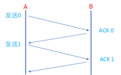
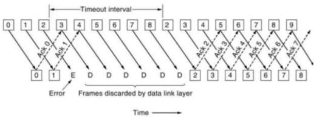

# KCP协议

## UDP协议如何保证数据的可靠传输
ACK机制
重传机制序号机制
窗口机制(流量控制、带宽限制)

补充:
    在网络中,我们认为传输是不可靠的，而在很多场景下我们需要的是可靠的数据，
    所谓的可靠，指的是数据能够正常收到,并且顺序收到。

## ARQ协议(Automatic Repest-reQuest)
AQR协议(自动重传请求),是传输层的错误纠正协议之一,它通过使用确认和超时两个机制,在不可靠传输的网络上实现可靠的信息传输。
ARQ的三种模式:
1.等停等式
2.回退n帧
3.选择性重传

### 等停等式
1.发送方对接收方发送数据包,然后等待接收方回复ACK并且开始计时,在等待过程中发送方停止发送数据包。
2.当数据包没有成功被接收方接受,接收方不会发送ACK,这样发送方会等待一定时间后后,重新发送数据包。

缺点:较长的等待时间导致低的传输速度

### 回退n帧
为了克服等停协议长时间等待ACK的缺陷,连续的ARQ协议会连续发送一组数据包，然后再等待这些数据包的ACK。

滑动窗口:
发送方和接收方都会维护一个数据帧的序列,这个序列被称为窗口。发送方的窗口大小由接收方确定,目的在于控制发送方的速度，以免接收方的缓存不够大,而导致溢出,同时控制流量也可以避免网络拥塞。协议中规定,对于窗口内未确认的分组需要重传。
回退n步:
回退n步协议允许发送方在等待超时的间歇可以继续发送分组。所有发送的分组,都带有序号。在GBN协议中,发送方需要响应以下三种事件:
1.上层的调用,上层调用相应send()时,发送方首先检查要检查发送窗口是否已满.
2.接收ACK，在该协议中,对序列号为n的分组确认采取累计确认方式,表明接收方已正确接收带序列号n以前(包括n)的所有分组
3.超时,若出现超时,发送方将重传所有已发送但未被确认的分组
(
    对于接收方来说,若一个序号为n的分组被正确接收,并且按序,则接收方会为该分组返回一个ACK给发送方,并将该分组中的数据交付给上层。在其他情况下，接收方都会丢弃分组。
    -->若分组n已接收并交付,那么所有比序号n小的分组也已完成交付。
    -->接收方在发完一个窗口里所有的分组后,会检查最大的有效确认,然后从最大有效确认的后的一个分组开始重传。
    
)

### 选择重传
虽然GBN的方式解决了等停协议中等待较长的缺陷,但它依旧存在性能问题,特别是当窗口长度很大的时候,会使效率大大降低，而SR协议通过让发送方仅重传在接收方丢失或损坏了的分组,从而避免不必要的重传,提高效率。
在SR协议下，发送方需响应以下三种事件:
1.从上层收到数据，当从上层收到数据后，发送方需检查下一个可用于该分组的序号。若序号在窗口中则将数据发送。
2.接收ACK。若收到ACK,则该分组在窗口内,则发送方将那个被确认的分组标记为已接收。若该分组序号等于基序号,则窗口序号向前移动到具有最小序号的未确认分组处。若窗口移动后并且有序号落在窗口内的未发送分组,则发送这些分组。
3.超时,若出现超时,发送方将重传已发送但还为确认的分组。与GBN不同的是,SR协议中的每个分组都有独立的计时器。
(
    在SR协议下,接收方需响应以下三种事件:
    -->序号在[4,7]内的分组被正确接收。该情况下,收到的分组落在接收方的窗口内，一个ACK将发送给发送方。若该分组是以前没收到的分组,则被缓存。若该分组的序号等于基序号4,则该分组以及以前缓存的序号连续的分组都被交付给上层，然后接收窗口向前移动。
    -->序号在[0,3]内的分组被正确接收。在该情况下，必须产生一个ACK，尽管该分组是接收方以前已确认过的分组。若接收方不确认该分组，发送方窗口将不能向前移动。
    -->其他情况。忽略该分组.
    ---------------------------------------
    对于接收方来说,若一个分组正确接收而不管其是否按序，则接收方会为该分组返回一个ACK给发送方。失序的分组将被缓存,直到所有丢失的分组都被收到，这样才可以将一个批分组按序交付给上层。
    ---------------------------------------
)

### RTT和RTO
1.RTO(Retransmission TimeOut)重传超时时间
2.RTT(Round-Trip Time)往返时延。表示从发送端发送数据开始,到发送端收到来自接收端的确认(接收端收到数据之后便立即发送确认),总共经历的时延。
由三部分组成:
-->链路的传播时间
-->末端系统的处理时间
-->路由器缓存中排队和处理时间。其中，前两个部分的值对于一个TCP连接相对固定,路由器缓存中的排队和处理时间会随着整个系统网络的拥塞程度的变化而变化。所以RTT的变化在一定程度上反应网络的拥塞程度。

### 流量控制
-->双方在通信的时候,发送方的速率与接收方的速率是不一定相等,如果发送方的发送速率太快,会导致接收方处理不过来，这时候接收方只能把处理不过来的数据存在缓冲区里(失序的数据包也会被存放在缓冲区里)接收缓存。

### 