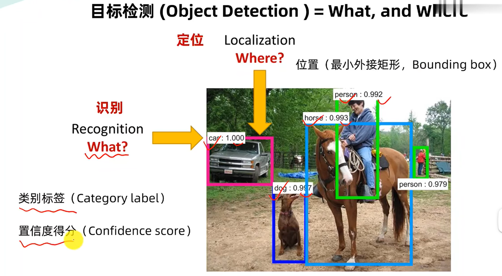
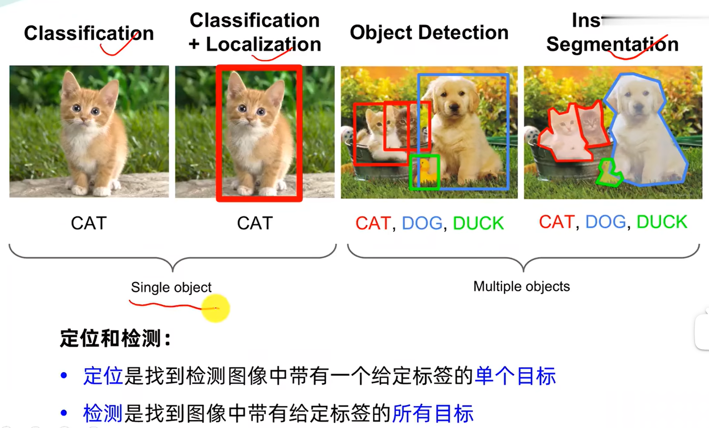
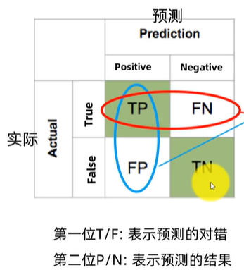
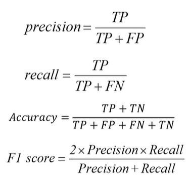
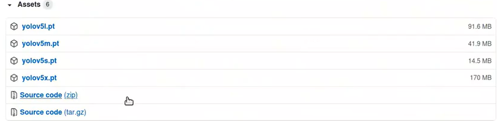
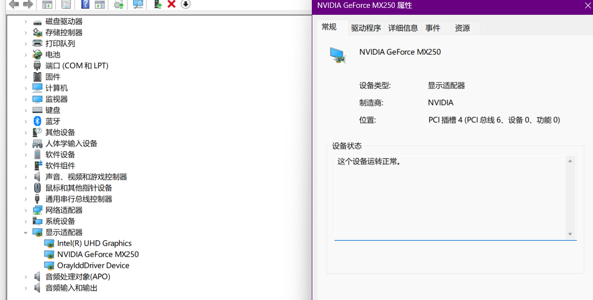
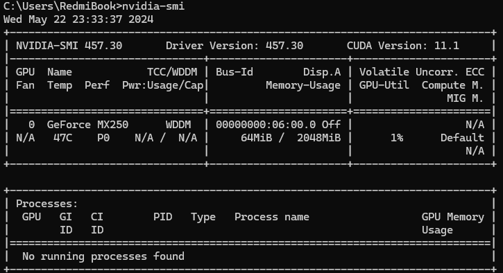
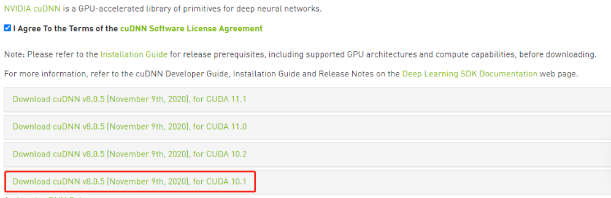

# 基础篇
## 目标检测任务说明
### 基本概念

(```目标检测,是计算机视觉中基本的任务之一，其主要任务是需要检测出图片中是什么,在什么位置```)

<b>识别(What)</b>
1.类别标签(Category label)
2.置信度得分(Confidence score)
<b>定位(where)</b>
1.最小外接矩形

### 常见任务

<b>单个目标</b>
<i>分类</i>
<i>分类+定位</i>

<b>多个目标</b>
<i>检测</i>
<i>实例分割</i>

## 目标检测常用数据集
### PASCAL VOC
***常用版本***
PASCAL VOC 2007
PASCAL VOC 2012
[下载链接](http://host.robots.ox.ac.uk/pascal/VOC/voc2012/ 'VOC数据集')
### MS COCO
[下载链接](http://cocodataset.org 'COCO数据集')

## 目标检测性能指标和计算方法
### 检测精度
Precision
ioU
P-R curve
AP
mAP

#### 混淆矩阵(confusion matrix)
(```精度(查准率)是评估预测的准不准```)
(```召回(查全率)是评估找的全不全```)



### 检测速度
前传耗时
每秒帧数 FPS
浮点运算量

# 环境配置
## buntu系统上配置训练环境
### 安装pytorch
#### 安装Anaconda
Anaconda是一个科学计算的Python发行版,支持Linux、Mac、Windows包含了众多流行的科学计算、数据分析的Python包。
1.下载地址
[下载链接](https://www.anaconda.com/download/#linux)
2.安装
(```bash Anacoda3-202007-Linux-x86_64.sh```)
anaconda会自动将环境变量添加到PATH里面,如果发现输出conda提示没有该
命令,那么需要执行 source ~/.bashrc更新环境变量.
如果发现还是没有没用,则需要手动加入条件变量...
在 ~/.bashrc文件最后面添加：
(```export PATH=/home/xxxx/anaconda3/bin:$PATH```)
保存退出后执行:source ~/.bashrc
输入conda list测试
3.添加Aanaconda国内镜像配置
清华TUNA提供了Aanaconda仓库的镜像,运行命令:
(```conda config --add channels https://mirrors.tuna.tsinghua.edu.cn/anaconda/pkgs/free```)
(```conda config --add channels https://mirrors.tuna.tsinghua.edu.cn/anaconda/pkgs/main```)
(```conda config --add show_channel_urls yes```)
#### 安装pytorch
注:需要安装pytorch1.6以上版本
1.首先为pytorch创建一个anaconda虚拟环境：
(```conda create -n xxxx python=3.8```)
2.创建成功后激活xxxx
(```conda activate xxxx```)
3.安装pytorch [10.2为cuda版本,与自己的对应]
(```conda install pytorch torchvision cudatoolkit=10.2 -c pytorch```)
4.配置环境变量
在~/.bashrc文件,设置使用xxxx虚拟环境下的python3.8
(```alias python='/home/xxxx/anaconda3/envs/xxxx/bin/python3.8'```)
保存退出: source ~./bashrcs
5.退出虚拟环境
(```conda unactivate xxxx```)
### yolov5项目克隆和安装
1.克隆yolov5
(```git clone https://github.com/ultralytics/yolov5.git```)
或者下载指定版本
[yolov5版本3.1](https://github.com/ultralytics/yolov5/releases/tag/v3.1)
2.安装所需的库
在yolov5环境下执行:
(```pip install -r requirements.txt https://pypi.tuna.tsinghua.edu.cn/simple```)
3.下载权重文件

4.安装测试
测试图片:
在yolov5路径下执行
(```python detect.py --source ./inference/images/ --weights weights/yolov5s.pt --conf 0.4```)
## Windows系统上配置训练环境
### 安装Nvidia显卡驱动、CUDA、cuDNN
1.下载和安装显卡驱动
首先在设备管理器中查看显卡型号

下载显卡对应的显卡驱动
[NVIDIA驱动下载](https://www.nvidia.cn/Download/index.aspx?lang=cn '显卡驱动')

2.下载和安装CUDA
[CUDA下载](https://developer.nvidia.com/cuda-toolkit-archive)
3.下载和安装cuDNN
[cuDNN下载安装](https://developer.nvidia.com/rdp/cudnn-download)
选择相应的cuda版本下载cuDNN版本

参考文章:
https://blog.csdn.net/jhsignal/article/details/111401628
### 安装Anaconda
下载安装包
[Anaconda下载Windows版](https://www.anaconda.com/products/individual)
安装anaconda
添加anaconda国内镜像配置
清华TUNA提供了Aanaconda仓库的镜像,运行命令:
(```conda config --add channels https://mirrors.tuna.tsinghua.edu.cn/anaconda/pkgs/free```)
(```conda config --add channels https://mirrors.tuna.tsinghua.edu.cn/anaconda/pkgs/main```)
(```conda config --add show_channel_urls yes```)
### 安装pytorch
注:需要安装pytorch1.6以上版本
1.首先为pytorch创建一个anaconda虚拟环境：
(```conda create -n xxxx python=3.8```)
2.创建成功后激活xxxx
(```conda activate xxxx```)
3.安装pytorch [10.2为cuda版本,与自己的对应]
(```conda install pytorch torchvision cudatoolkit=10.2 -c pytorch```)
### yolov5项目克隆和安装
1.克隆yolov5
(```git clone https://github.com/ultralytics/yolov5.git```)
或者下载指定版本
[yolov5版本3.1](https://github.com/ultralytics/yolov5/releases/tag/v3.1)
2.安装所需的库
在yolov5环境下执行:
(```pip install -r requirements.txt https://pypi.tuna.tsinghua.edu.cn/simple```)
3.下载权重文件

4.安装测试
测试图片:
在yolov5路径下执行
(```python detect.py --source ./inference/images/ --weights weights/yolov5s.pt --conf 0.4```)
