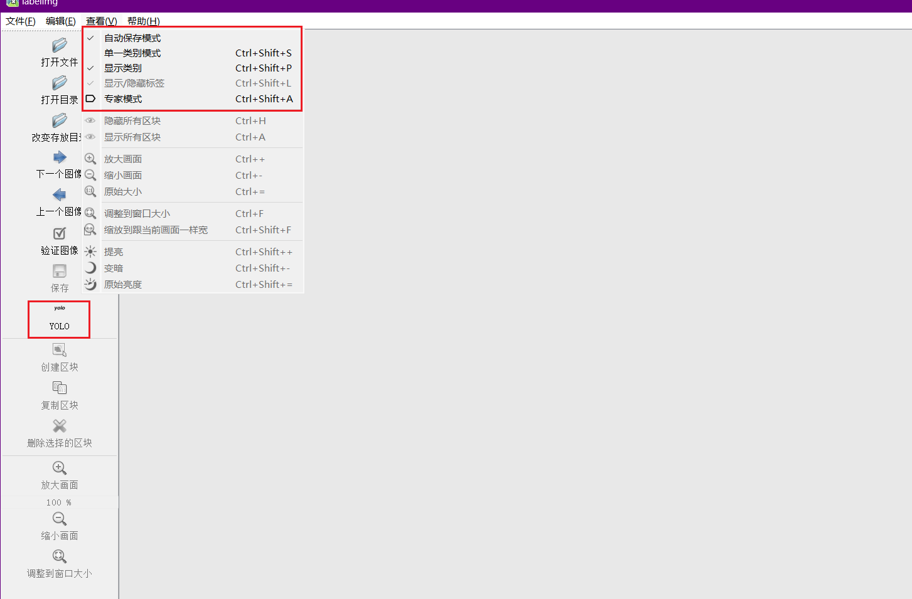

## 收集数据集
### 采集数据集(最好在不同环境、不同天气、不同时间段)一千张以上效果比较好
### YYOLOV标签(样本)
    用labelImg

    注:需要将标签转换成yolov5的数据格式
    数据格式：label_index，cx， cy，w，h
    - label_index :为标签名称在标签数组中的索引，下标从 0 开始
    - cx：标记框中心点的 x 坐标，数值是原始中心点 x 坐标除以图宽后的结果
    - cy：标记框中心点的 y 坐标，数值是原始中心点 y 坐标除以 图高 后的结果
    - w：标记框的 宽，数值为 原始标记框的 宽 除以 图宽 后的结果
    - h：标记框的 高，数值为 原始标记框的 高 除以 图高 后的结果

    0 0.898698 0.284259 0.018229 0.081481

3.自定义的数据集
  dataSet
  |
  |--images(原图片)
  |    xxx01.jpg
  |    xxx02.jpg
  |--lables(标签)
  |    xxx01.txt
  |    xxx02.txt
  |--data.yaml
  |    参考:voc.yaml

## 训练
python train.py --data dataSet/data.yaml --cfg models/yolov5s_voc.yaml --weights weights/yolov5s.pt --batch-size 4 --epochs 100
训练参数:
===============================================================================
train.py
--weight: 指的是训练好的网络模型,用来初始化权重
--cfg: 指的是网络结构
--data: 训练的数据路径
--hyp: 训练网络的一些超参数设置
--epochs: 训练迭代次数
--batch-size: 每次喂给神经网路的图片数目
--imgsz: 训练图片尺寸
--rect: 是否采用矩形训练
--resume:指定你之前训练的网络模型,想继续训练这个模型
--nosave:只保留最终网络模型
--noval:是否只在最后一次测试网络模型
--noautoanchor:是否采用锚点
--evolve:是否寻找最优参数
--bucket:(无效参数)
--cache:是否对图片进行缓存,加快训练
--image-weights:测试过程中,图像的那些测试地方不太好,对这些不太好的地方加权重
--device:训练网络的设备CPU还是gpu
--multi-scale:图片尺度变换
--single-cls:训练数据集是单类还是多类别
--adam:是否采用adam
--sync-bn:分布式训练
--workers:多线程训练
--project:训练结果保存路径
--name:训练结果保存文件名
--exist-ok:覆盖掉上一次的结果，不新建训练结果文件
--quad:在dataloder时采用什么样的方式读取我们的数据
--linear-lr:按照线性的方式去调整学习率
--label-smoothing:对标签平滑,防止过拟合
--patience:暂无
--freeze:冻结哪些层,不去更新训练这几层的参数
--save-period:训练多少次保存一次网络模型
--local_rank:分布式训练
===============================================================================

## 测试
python detect,py --source ./inference/images/ --weights weights/yolov5s.pt --conf 0.4